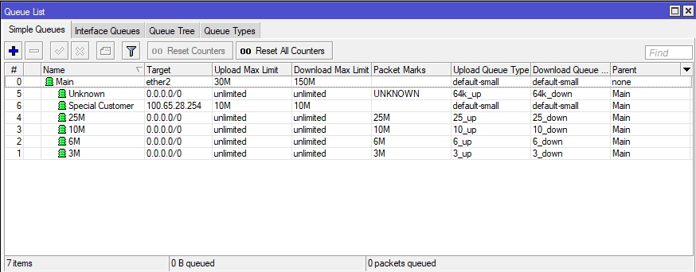

# MikroTik Advanced Bandwidth Management
MikroTik's RouterOS gives you the tools to create an advanced bandwidth management system, allowing you to ensure that your users have the best possible experience, even during peak hours with limited upstream bandwidth.

In this scenario, we're working with the following requirements:

* 200M total bandwidth available 
* ether2 is the customer-facing interface
* Unknown number of users need to share this bandwidth
* Each user will be assigned one of 4 different bandwidth packages
  * 3M
  * 6M
  * 10M
  * 25M

### Queue Types - Create all your PCQ definitions

The first thing we need to do, is create your PCQ definitions.  We'll need 2 types for each of your bandwidth packages.

```
/queue type
add kind=pcq name=3_down pcq-classifier=dst-address pcq-rate=3M
add kind=pcq name=3_up pcq-classifier=src-address pcq-rate=384k
add kind=pcq name=6_down pcq-classifier=dst-address pcq-rate=6M
add kind=pcq name=6_up pcq-classifier=src-address pcq-rate=768k
add kind=pcq name=10_down pcq-classifier=dst-address pcq-rate=10M
add kind=pcq name=10_up pcq-classifier=src-address pcq-rate=2M
add kind=pcq name=25_down pcq-classifier=dst-address pcq-rate=25M
add kind=pcq name=25_up pcq-classifier=src-address pcq-rate=3M
```

### Simple Queues - Build your queue structure

We'll start with a regular queue, then add in child queues to consume that bandwidth.

```
/queue simple
add max-limit=40M/200M name=Main target=ether2
add name=3M packet-marks=3M parent=Main queue=3_up/3_down target=""
add name=6M packet-marks=6M parent=Main queue=6_up/6_down target=""
add name=10M packet-marks=10M parent=Main queue=10_up/10_down target=""
add name=25M packet-marks=25M parent=Main queue=25_up/25_down target=""
```

### Mangle Rules to mark your packets

```
/ip firewall mangle
add action=mark-packet chain=postrouting dst-address-list=25M new-packet-mark=25M out-interface=ether2 packet-mark=no-mark passthrough=no
add action=mark-packet chain=prerouting in-interface=ether2 new-packet-mark=25M packet-mark=no-mark passthrough=no src-address-list=25M
add action=mark-packet chain=postrouting dst-address-list=10M new-packet-mark=10M out-interface=ether2 packet-mark=no-mark passthrough=no
add action=mark-packet chain=prerouting in-interface=ether2 new-packet-mark=10M packet-mark=no-mark passthrough=no src-address-list=10M
add action=mark-packet chain=postrouting dst-address-list=6M new-packet-mark=6M out-interface=ether2 packet-mark=no-mark passthrough=no
add action=mark-packet chain=prerouting in-interface=ether2 new-packet-mark=6M packet-mark=no-mark passthrough=no src-address-list=6M
add action=mark-packet chain=postrouting dst-address-list=3M new-packet-mark=3M out-interface=ether2 packet-mark=no-mark passthrough=no
add action=mark-packet chain=prerouting in-interface=ether2 new-packet-mark=3M packet-mark=no-mark passthrough=no src-address-list=3M
```

### Basic Provisioning

At this point, there are a couple ways to handle provisioning.  DHCP and Firewall Address Lists.

#### DHCP

When a new client obtains a lease, we make it static, then assign an address list and add a comment.  You can also use RADIUS to assign the address list to dynamic leases, but that is outside the scope of this document.

#### IP Firewall Address-list

This is another way to handle address list assignments.  Just add the IP to the list and you're good to go.


### Advanced Provisioning

Cookie cutter configs are always awesome, but they will not work in all scenarios.


#### Special Queues

Let's say you have a customer that wants a 10M symetrical bandwidth package.  This is easily accomodated by creating a couple new mangle rules and a simple queue.  Make sure the simple queue has the parent set do that the bandwidth it's consuming is accounted for.

```
/ip firewall mangle
add action=mark-packet chain=postrouting dst-address-list=SIMPLE new-packet-mark=SIMPLE out-interface=ether2 packet-mark=no-mark passthrough=no
add action=mark-packet chain=prerouting in-interface=ether2 new-packet-mark=SIMPLE packet-mark=no-mark passthrough=no src-address-list=SIMPLE

/queue simple
add max-limit=10M/10M name="Special Customer"  parent=Main target=100.65.28.254/32
```

#### Blocking Disconnected Customers

From time to time, customers neglect to pay their bill and you need to disconnect them.  To accomodate this, we just need to add a firewall filter.  Once you have this, simply add the DICSO address list in teh DHCP lease or firewall address lists.

```
/ip firewall filter
add action=drop chain=forward src-address-list=DISCO
``` 

#### Identifying Unprovisioned Customers

It can be helpful to identify unknown/unprovisioned addresses that are being used.  We can either block or throttle these guys, that's up to you.

```
/ip firewall mangle
add action=add-src-to-address-list address-list=UNKNOWN address-list-timeout=10m chain=forward in-interface=ether2 packet-mark=no-mark src-address-list=!UNKNOWN
```

#### Blocking Unprovisioned Customers

Personally, I prefer to throttle unprovisioned IP addresses rather than blocking them, but if you need to block them, you can do so by adding one more firewall rule.

```
/ip firewall filter
add action=drop chain=forward src-address-list=UNKNOWN
```


#### Throttling Unprovisioned Customers

My preferred method is to let them have a very little bit of bandwidth.  Enough to know things are working, but not enough to actually do anything.  We can do this by adding one more queue type and one additional simple queue.  This queue MUST be in the last queue in the tree, as it will match ALL traffic not already processed.

```
/queue type
add kind=pcq name=64k_up pcq-classifier=dst-address pcq-rate=64k
add kind=pcq name=64k_down pcq-classifier=src-address pcq-rate=64k

/queue simple
add name=Unknown parent=Main queue=64k_up/64k_down target=""
```

### Wrapping Up

There's a lot to digest.  I'm not covering things like setting up the DHCP server or address lists.  Truth be told, those are pretty basic items, but here's a few images that might help.

As you can see, the queues all consume bandwidth from the parent.  I highly suggest running a bandwidth test to determine the true capcity of your link, then setting the parent quuee to about 95% of the actual capcity.



Here are the mangle rules.  Nothing special, but added a couple comments.


Here's a DHCP lease with an address list set to 25M


Here's the same lease after the customer has been disconnected.


